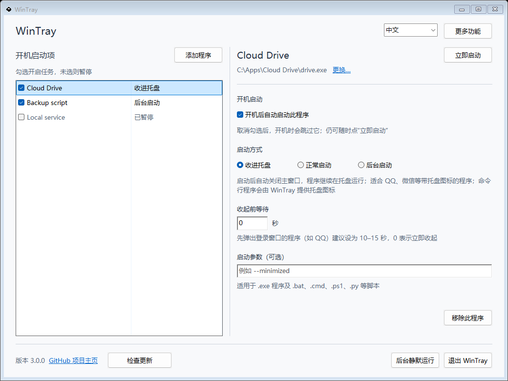

<div align="center">

# WinTray


**A lightweight Windows startup organizer for silent launch and window management**

[](LICENSE)
[]()
[]()

English | [简体中文](README.md)

</div>

---

## Introduction

**WinTray** is a lightweight Windows startup organizer designed to eliminate desktop clutter from startup popups and flashing console windows, giving you a clean desktop after every boot.

Core use cases:

- **Auto-Hide Windows**: Automatically closes the main window of applications lacking a native "start minimized to tray" option, keeping them running quietly in the tray.
- **Silent Script Launch**: Runs `.bat`, `.cmd`, `.ps1`, `.py`, and `.pyw` scripts completely hidden in the background without intrusive console windows.




---

## Features

- **Tray Resident**: Lives in the notification area with one-click access to settings and exit
- **Managed Program List**: Maintain any number of programs, each with independent behavior configuration
- **Auto Start**: Registers a per-user logon task that starts WinTray right after sign-in, ahead of the `Run` entries Explorer launches one by one; no administrator rights needed. Falls back to the current user's `Run` registry key if the task cannot be registered
- **Auto Hide Windows**: When configured in the program list, the `--autorun` flow automatically minimizes and hides target windows
- **Retry on Window Handling**: Configurable 0–120 second retry window for slow-starting programs
- **Close Delay**: Per-program running time a program must reach before its window is handled, to skip login dialogs and other pre-launch popups (such as the new QQ); also covers instances started by the program's own auto-start
- **Staggered Startup**: Launch programs in list order, 3 seconds apart by default; adjust the interval from 0–120 seconds in Global Settings to reduce competing startup workloads
- **Cleanup & Restore Defaults**: One-click cleanup of local config/logs from the main window
- **Bilingual UI**: Built-in Simplified Chinese / English, switchable instantly
- **Single Instance Protection**: Prevents duplicate launches to avoid configuration conflicts

---

## Download & Usage

WinTray is **portable only** — no installation needed.

Go to the [Releases](../../releases) page, download the latest `WinTray-Portable-vX.Y.Z.zip`, extract it, and run `WinTray.exe` directly.

- Configuration and logs are stored in `%LOCALAPPDATA%\WinTray\` with no registry dependencies
- To remove completely, simply close the program and delete the folder

---

## Supported Program Types

WinTray supports adding the following program types to the managed list, automatically launching and handling their windows at startup:

| Type              | File Extension  | Launch Behavior                                                               |
| ----------------- | --------------- | ----------------------------------------------------------------------------- |
| Executable        | `.exe`          | Foreground launch by default; can optionally close the window to hide to tray; console programs get a WinTray-hosted tray icon |
| Batch script      | `.bat` / `.cmd` | Hidden background launch by default (no console window)                       |
| PowerShell script | `.ps1`          | Hidden background launch by default                                           |
| Python script     | `.py` / `.pyw`  | Hidden background launch by default, invokes `python.exe` / `pythonw.exe`       |

> Non-`.exe` scripts (`.bat` / `.cmd` / `.ps1` / `.py` / `.pyw`) automatically enable the "Launch hidden in background" option when added, and cannot simultaneously use "Close window after launch".

> **Important:** Some applications contain multiple `.exe` files, such as launchers, updaters, helper processes, and the actual main program. When adding an application, select the executable that owns the main visible window. Selecting the wrong `.exe` may allow the program to start, but WinTray may not find its window, so closing or hiding the window after launch will not take effect.

### Per-Program Configuration Options

- **Launch Arguments**: Pass custom command-line arguments to the program
- **Close Window After Launch**: Sends a close message (WM_CLOSE) after launch — most tray-aware apps minimize to tray rather than quitting; a destroyed or invisible window is considered successfully handled. Console programs without a tray icon of their own (such as `syncthing.exe` or `frpc.exe`) would be terminated by a close, so WinTray hides their console window instead and hosts a tray icon for them: left-click toggles the window, and the context menu can show, hide, stop hosting (the window comes back and the program keeps running) or quit the program. All hosted icons are owned by **the main WinTray process**, without an extra WinTray process per program. With automatic exit enabled, WinTray hides its settings and its own icon while any hosted icons remain, then exits when the last hosting session ends. Manually choosing "Exit WinTray" restores hidden windows before exiting; to keep those hosted icons instead, choose "Run silently" at the bottom of the settings window or in the WinTray tray menu. Exit WinTray before deleting it: `WinTray.exe` remains in use while running
- **Close Delay**: Available with "Close window after launch". WinTray only looks for the window and closes it once the program's process has been running for the configured number of seconds (0–600). Use it for programs that show a login window first: the new NT-based QQ quits when its login window is closed, so set a delay that covers the whole login (auto-login usually takes 15–30 seconds) and WinTray only handles the main window that appears afterwards. The delay counts from the creation of the program's process, whether WinTray or the program's own auto-start launched it: an instance already auto-started at logon still has to reach the delay before it is handled, while an instance running for longer is handled right away, so the program's own auto-start can stay enabled
- **Launch Hidden in Background**: Starts the program without any visible window, suitable for command-line and script programs
- **Pause Task**: Skip this program on every logon until unpaused; "Launch Now" remains available

### Staggered Startup

The global **Launch interval** sets the minimum gap between actual process launches by WinTray: **3 seconds** by default, configurable from **0–120 seconds** (`startupIntervalSeconds` in settings). Older settings without this field use 3 seconds. Setting it to 0 removes the wait, while launches still begin in list order. There is no extra wait before the first launch or after the last one.

- Paused, already-running, invalid and failed entries do not add an interval.
- Close delays, window detection and waiting for an external autorun run concurrently, without holding up later launches. Hidden console programs are handed to their tray hosts as soon as their tasks finish, not at the end of the batch.
- "Launch Now" is unaffected. This is fixed-interval staggering, not CPU/memory-adaptive throttling; increase the interval for heavier programs.
- **Only launches performed by WinTray are paced.** Enabled Windows `Run` entries remain scheduled by Windows; WinTray waits for those programs and handles their windows, without rescheduling them or modifying other programs' startup settings.

### Window Matching

WinTray automatically combines the process ID, executable path, process name, and
window features to select a target. An action is only sent after the safety score
reaches the threshold, so no matching strategy needs to be configured.

Scoring system (an action is only taken when the total score ≥ 500):

- **+1000**: Exact PID match (process launched by WinTray)
- **+500**: Exact executable path match
- **+250**: Process name match (case-insensitive)
- **+200**: New window that appeared after launch
- **+50**: Non-empty window title
- **-80**: Tool window (auxiliary, skipped)
- **-60**: Window with an owner (child/owned window, skipped)

### Common Use Cases

| Scenario                                                     | Configuration                                            |
| ------------------------------------------------------------ | -------------------------------------------------------- |
| WeChat / DingTalk auto-start and minimize to tray            | Add `.exe`, enable "Close window after launch"           |
| New QQ (NT-based) auto-start, minimize to tray after login   | Add `QQ.exe`, enable "Close window after launch", set a "Close delay" (e.g. 10–15 s) to skip the login window; QQ's own auto-start can stay enabled |
| syncthing / frpc console programs running in the background, reachable from the tray | Add `.exe`, enable "Close window after launch"; WinTray hosts the tray icon |
| Tunnel scripts (frpc / SSH) running in background at startup | Add `.bat` / `.ps1`, hidden background launch by default |
| Python crawler/service starting silently in background       | Add `.py`, hidden background launch by default           |
| Auto-start only, no window handling                          | Add program, leave "Close window after launch" unchecked |

---

## System Requirements

The source and release package support Windows only; cross-platform builds are not supported.

| Item              | Requirement                                        |
| ----------------- | -------------------------------------------------- |
| OS                | Windows 10 / 11                                    |
| Runtime           | No additional dependencies (standalone executable) |
| Build from source | Go 1.25+                                           |

---

## Data Directory

| Type          | Path                                   |
| ------------- | -------------------------------------- |
| Configuration | `%LOCALAPPDATA%\WinTray\settings.json` |
| Logs          | `%LOCALAPPDATA%\WinTray\wintray.log`   |

---

## Command-Line Arguments

| Argument            | Description                                                      |
| ------------------- | ---------------------------------------------------------------- |
| `--background`      | Start without showing the main window (for auto-start scenarios) |
| `--autorun`         | Execute managed program tasks automatically (used by auto-start) |
| `--cleanup-restore` | Only perform cleanup: clear `%LOCALAPPDATA%\WinTray\` and exit   |
| `--host`            | Compatibility with older standalone hosts only; new launches do not create additional host processes |

At logon, **Exit after tasks (keep hosting)** works as follows:
- No hosted icons: exit once the tasks finish.
- Hosted icons remain: hide settings and WinTray's own icon, leaving only the programs' icons; exit after the last hosted program ends or is released.
- Open WinTray again to access the existing instance's settings. It will not auto-exit while settings are open or a manual launch is in progress.
- Manually choose "Exit WinTray" to cancel pending tasks, restore hidden program windows, and exit.

**Run silently** (next to "Exit WinTray" at the bottom of the settings window, and in the WinTray tray menu) is available at any time, regardless of how WinTray was started or the option above:
- It hides the settings window and WinTray's own icon. Hidden program windows stay hidden, and hosted icons for console programs such as syncthing and frpc remain available.
- Logon tasks or "Launch Now" runs still in progress finish and hand off their icons. WinTray then exits when the last hosted program ends or stops being hosted, or immediately if nothing is hosted.
- Running WinTray again shows the settings and its own icon and ends silent mode.

With this option disabled, WinTray keeps its own tray icon. "Minimize to tray after launch" controls whether settings are initially shown in that resident mode.

---

## Project Structure

```text
.
├─ .github/workflows/      # CI/CD and Release automation
├─ build/                  # Build scripts (package.ps1) and app manifest
├─ cmd/wintray/            # Program entry point
└─ internal/               # Core business logic
```

---

## FAQ

**Q: I don't see a main window after launch — how do I access settings?**
A: Right-click WinTray's tray icon and select "Open Settings". If automatic-exit mode leaves only the hosted programs' icons, run `WinTray.exe` again to open settings in the existing process.

**Q: How do I disable auto-start after it's been enabled?**
A: Uncheck "Run WinTray at logon" in the settings page; the logon task and registry entry are removed automatically. You can also use "Remove sign-in task" under More Features → Troubleshooting, which deletes both and turns running at sign-in off after confirmation.

**Q: The new QQ doesn't minimize to the tray; instead the login fails or QQ quits.**
A: The new QQ shows a login window first and quits when that window receives a close message. Set a "Close delay" for it that covers the whole login (auto-login usually takes 15–30 seconds; allow more for manual login). Whether WinTray or QQ's own auto-start launched it, WinTray waits until QQ has been running for the delay and its main window is up before closing it.

**Q: Can QQ's own auto-start and WinTray launch two instances?**
A: WinTray checks enabled `HKCU/HKLM Run` entries (including 32-bit entries) that directly launch the configured executable, respecting Task Manager's disabled state. If one exists, WinTray only waits for Windows to start the program, for up to 300 seconds, then applies the configured close delay before handling its window. A timeout is logged explicitly, with **no fallback launch**, so a later Windows launch does not create a duplicate. "Launch now" can still start an absent program manually. Detection does not cover scheduled tasks, Startup-folder items, or indirect launches through third-party launchers, and does not change other programs' startup settings.

**Q: A program in my list isn't being minimized automatically.**
A: Make sure the program has "Close window after launch" enabled, and that WinTray was triggered with the `--autorun` flag (auto-start does this automatically). If the program starts slowly, try increasing the retry seconds setting.

---

## License

This project is released under the [MIT License](LICENSE).

