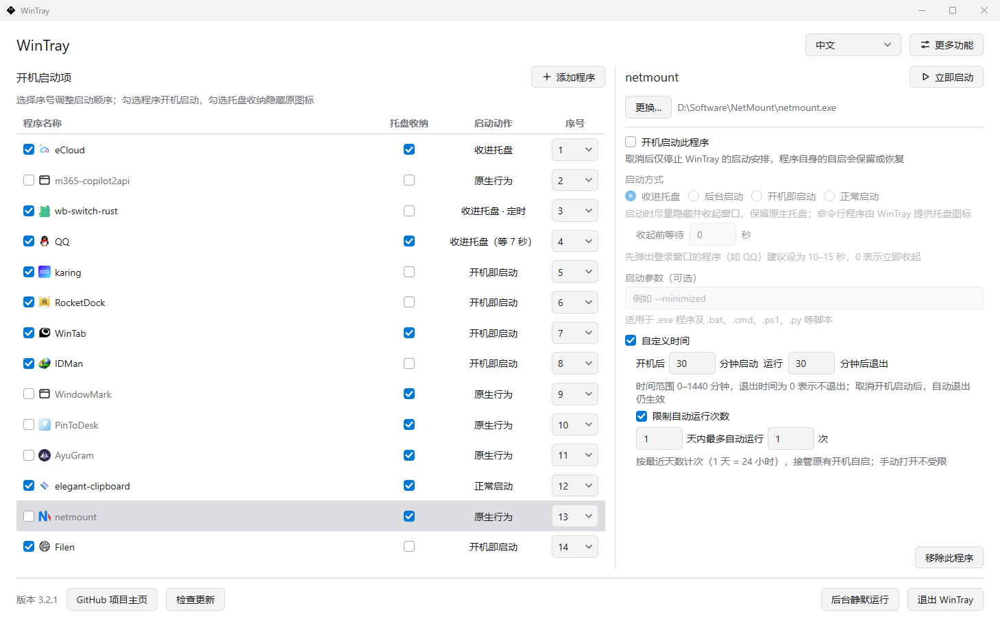
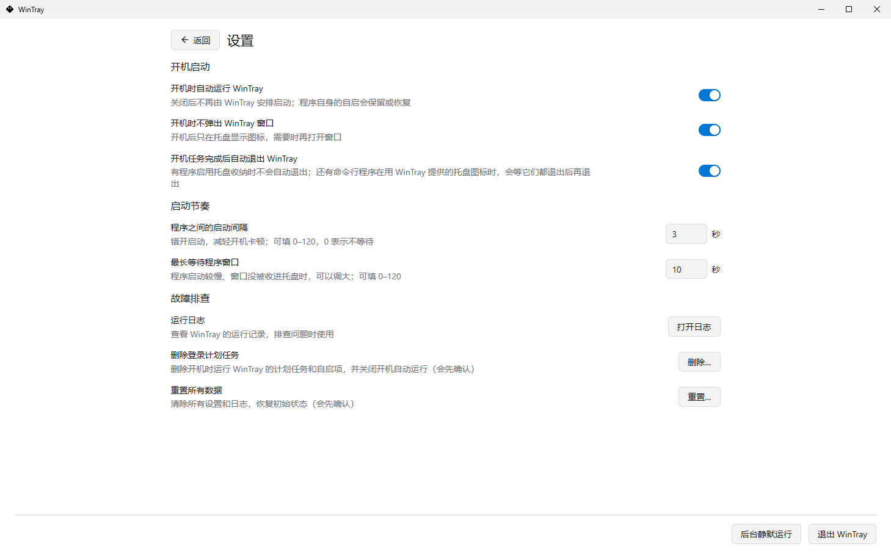

# WinTray

**A lightweight Windows startup organizer for silent launch and window management**

English | [简体中文](README.md)

---

## Introduction

**WinTray** is a lightweight Windows startup organizer that clears the clutter of startup popups and flashing console windows, leaving you a clean desktop after every boot.

- **Auto-Hide Windows**: Applications with no "minimize to tray at sign-in" option get their main window closed after launch and keep running in the tray.
- **Silent Scripts**: Runs `.bat`, `.cmd`, `.ps1` and `.py` scripts hidden in the background, with no console window.

---

## Features

- **Close to Tray**: Programs with no "minimize to tray" option get their window closed and keep running in the tray
- **Tray Icons** (Windows 11): Collects a program's own tray icon into WinTray's menu, leaving only WinTray on the taskbar
- **Hosted Tray Icons**: Console programs such as `syncthing` and `frpc` get a tray entry, hosted by WinTray
- **Launch at Boot**: Replaces only the sign-in trigger, keeping the program's original arguments, silent behavior and privileges
- **Custom Timing**: Delays a program's start after sign-in and quits it after a set run time
- **Limit Automatic Launches**: Caps automatic launches to N runs within the last M days
- **Wait Before Closing**: Programs that show a login window first (such as the new QQ) are closed only after sign-in completes

---

## Download & Usage

WinTray is **portable only** — no installation needed.

Go to the [Releases](../../releases) page, download the latest `WinTray-Portable.zip`, extract it, and run `WinTray.exe`.

Configuration, logs and original-startup recovery backups are stored in `%LOCALAPPDATA%\WinTray\`. Before deleting the program folder, use **Reset…** in Settings → Troubleshooting to restore migrated startup states and remove WinTray tasks; do not delete a data directory that still contains recovery backups.

---

## Supported Program Types

| Type              | File Extension  | Default Launch Behavior                                                                |
| ----------------- | --------------- | -------------------------------------------------------------------------------------- |
| Executable        | `.exe`          | Starts normally; can be set to "Close to tray". Console programs get a WinTray-hosted tray icon |
| Batch script      | `.bat` / `.cmd` | Runs in the background (no console window)                                              |
| PowerShell script | `.ps1`          | Runs in the background                                                                  |
| Python script     | `.py` / `.pyw`  | Runs in the background                                                                  |

> Non-`.exe` scripts are fixed to "Run in background" when added and cannot use "Close to tray" or "Launch at boot".

> **Note:** Some applications contain multiple `.exe` files (launchers, updaters, etc.); pick the one that owns the main window, or "Close to tray" won't take effect.

---

## Per-Program Settings

- **How it starts** (choose one): **Close to tray** — closes the main window after launch, the program keeps running in the tray / **Run in background** — no window at all, best for scripts and command-line tools / **Launch at boot** — changes only the original startup trigger / **Start normally** — just starts the program, window untouched
- **Wait before closing**: With "Close to tray", closes the window only after the program has run the set number of seconds, **0–600**; programs with a sign-in window (10–15 seconds for the new QQ) use it to skip the login process
- **Arguments**: Optional; used by "Launch at boot" only when no original startup entry exists, and passed straight to the program in the other modes
- **Start this program at sign-in**: Unchecking stops WinTray's launch scheduling; the program's own startup remains or is restored

### Close-to-Tray Startup

WinTray tries to hide startup windows, then closes them once the program has run for the configured delay, keeping the native tray. If closing fails or is cancelled, the windows become visible again.

**Some programs may still briefly show a window.** Complete manual sign-in first or choose "Start normally".

Console programs with no tray icon of their own (`syncthing.exe`, `frpc.exe`, …) get a WinTray-hosted icon with "Close to tray": left-click shows/hides the window, and the context menu can show, hide, stop hosting or quit the program.

### Tray Icons

Check **Tray icon** in the program list to move the program's existing tray icons into WinTray's right-click menu. Requires Windows 11 and an `.exe` program.

- Icons disappear from the taskbar and the `^` flyout; menu entries use the program's current icon and name
- Click to open the program; if no window appears, WinTray sends a double-click. Right-click opens its own tray menu
- Unchecking the option or exiting WinTray normally restores the icons; unselected programs keep their native tray icons
- Failed collection attempts restore the original icon where possible and log the cause

### Launch at Boot: Preserve Original Startup Settings

Only the startup trigger is replaced; the program's own startup configuration is left untouched.

- **Reuse the original entry**: Existing logon tasks, registry entries and Startup-folder shortcuts are all reused; only a recoverable enable state is toggled to prevent double launches. Duplicate tasks left by older WinTray versions are removed.
- **Arguments and privileges unchanged**: Preserve original arguments, silent startup, privileges and working directory. New administrator tasks require one confirmation.
- **Startup timing**: New tasks start as soon as WinTray and the desktop are ready, without the staggering interval. Existing tasks retain their delays, and "Custom timing" still applies. A readiness timeout reports an error.
- **Clean undo**: Switching modes, pausing, removing an entry or turning off WinTray startup deletes the replacement task and restores the enable states; the program's own startup is never touched.
- **Errors instead of guesses**: Missing, disabled or unresolvable entries report an error rather than guessed flags or a bare-executable fallback. Use "Start normally" for such programs.

### Custom Timing

All fields remain editable when "Start this program at sign-in" is off:

- **Start delay**: **0–1440 minutes** after sign-in, default **0**.
- **Auto-quit**: quit after **0–1440 minutes**, including child processes; default **30**, **0** means never quit. Still applies when "Start this program at sign-in" is off.
- **Limit automatic launches**: at most **1–1000 launches** within the last **1–365 days**. Off by default; starts at **1 launch per day** when enabled. **1 day = 24 hours**; restarting or crossing midnight does not reset the count.

The limit applies only to automatic sign-in launches. Manual launches and "Launch Now" are unrestricted. Enabling it takes over original sign-in startup; disabling it restores the previous startup arrangement. Takeover failures show an error; administrator tasks require one confirmation.

Start delay and launch limits apply when "Start this program at sign-in" is on; auto-quit can work independently. Unchecking "Custom timing" disables all three settings.

### Staggered Startup

The **Delay between programs** in Settings sets the minimum gap between launches — **3 seconds** by default, adjustable from **0–120 seconds**. Choose a number in each program's **Order** dropdown to change the start order; "Launch Now" is unaffected.

---

## Common Use Cases

| Scenario                                                                          | Configuration                                         |
| --------------------------------------------------------------------------------- | ----------------------------------------------------- |
| WeChat / DingTalk auto-start and minimize to tray                                 | Add `.exe`, set "How it starts" to "Close to tray"     |
| New QQ auto-start, minimize to tray after login                                   | Add `QQ.exe`, set "Close to tray" and "Wait before closing" to 10–15 s |
| syncthing / frpc and similar console programs running in the background, reachable from the tray | Add `.exe`, set "Close to tray"    |
| Tunnel and crawler scripts running silently at startup                            | Add `.bat` / `.ps1` / `.py`, set "Run in background"   |
| Administrator tools starting fast at sign-in                                      | Add the `.exe`, set "How it starts" to "Launch at boot" |

---

## Residency & Exit

With "Exit WinTray when sign-in tasks finish" unchecked, WinTray keeps its own tray icon, and "Don't show the WinTray window at sign-in" controls whether settings are shown in that mode.

**It never exits while any program uses tray collection**; if console programs still use tray icons from WinTray, it waits until they all exit.

Choose **Run silently** in the settings footer or the tray menu to hide the window and keep running; run `WinTray.exe` again to restore it.

---

## System Requirements

The source and release package support Windows only; cross-platform builds are not supported.

| Item              | Requirement                                        |
| ----------------- | -------------------------------------------------- |
| OS                | Windows 10 / 11                                    |
| Runtime           | No additional dependencies (standalone executable) |
| Build from source | Go 1.27.1+                                         |

---

## Data Directory

| Type             | Path                                           |
| ---------------- | ---------------------------------------------- |
| Configuration    | `%LOCALAPPDATA%\WinTray\settings.json`         |
| Startup recovery | `%LOCALAPPDATA%\WinTray\startup-migrations.json` |
| Logs             | `%LOCALAPPDATA%\WinTray\wintray.log`           |

---

## FAQ

**Q: I don't see a main window after launch — how do I access settings?**
A: Right-click WinTray's tray icon and select "Open WinTray", or run `WinTray.exe` again.

**Q: How do I disable auto-start after it's been enabled?**
A: Turn off "Run WinTray at sign-in" in Settings. WinTray's task/startup entry and replacement program tasks are removed; applications' original startup remains or is restored, not disabled together with WinTray. The "Remove…" action under Settings → Troubleshooting deletes only the sign-in task.

**Q: The new QQ doesn't minimize to the tray; instead the login fails or QQ quits.**
A: The new QQ shows a login window first and quits if it is closed too early. Set "Wait before closing" longer than the whole login (auto-login usually takes 15–30 seconds).

**Q: Can QQ's own auto-start and WinTray launch two instances?**
A: No. When the program's own `Run` entry is enabled, WinTray just waits for Windows to start it and **never launches it again**.

**Q: A program in my list isn't being minimized to the tray.**
A: Make sure the program is set to "Close to tray" and "Run WinTray at sign-in" is on. If the program starts slowly, increase "Wait for a window up to".

---

## License

This project is released under the [MIT License](LICENSE).
