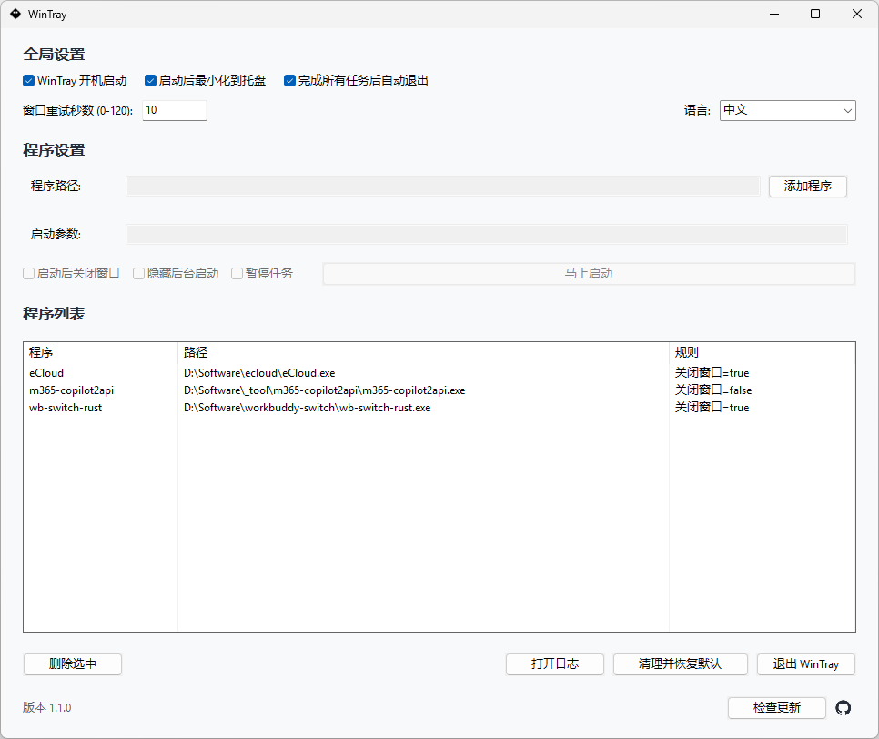

<div align="center">

# WinTray


**Windows 开机自动隐藏程序界面的工具**

[English](README.en.md) | 简体中文

</div>

***

## 简介

WinTray 是一款面向 Windows 的开机整理工具。它在系统托盘常驻运行，在开机自启流程触发时，按规则自动处理指定程序的窗口（例如自动最小化或隐藏），省去每次开机后手动收拾桌面的麻烦。

WinTray 最主要用于两类场景：让可以随 Windows 开机自启动、但不支持启动后最小化到托盘的软件自动关闭界面并继续运行；让 `.bat`、`.cmd`、`.ps1`、`.py` 和 `.pyw` 程序以后台无窗口方式启动，实现开机后无感运行。



***

## 功能特性

* **托盘常驻**：系统通知区图标，支持一键打开设置和退出程序

* **受管程序列表**：可维护任意数量的程序，每个程序独立配置执行行为

* **开机自启**：写入当前用户 `Run` 注册表项，随 Windows 登录自动启动

* **自动隐藏窗口**：程序列表中配置后，`--autorun` 流程触发时自动最小化并隐藏目标窗口

* **窗口处理重试**：支持 0–120 秒的可配置重试等待，应对启动慢的程序

* **清理并恢复默认**：可在主窗口一键清理本地配置/日志并恢复默认状态

* **单实例保护**：防止重复启动，避免配置冲突

***

## 下载与使用

WinTray 仅提供**便携版**，无需安装。

前往 [Releases](../../releases) 页面，下载最新版本的 `WinTray-Portable-vX.Y.Z.zip`，解压后直接运行 `WinTray.exe` 即可。

* 配置与日志写入 `%LOCALAPPDATA%\WinTray\`，不依赖任何注册表安装项

* 不再使用时关闭程序、删除文件夹即可彻底移除

***

## 支持托管的程序类型

WinTray 支持添加以下类型的程序到受管列表，在开机时自动启动并处理窗口：

| 类型            | 文件扩展名           | 启动行为                          |
| ------------- | --------------- | ----------------------------- |
| 可执行程序         | `.exe`          | 默认前台启动，可选择"启动后关闭窗口"将界面隐藏到托盘   |
| 批处理脚本         | `.bat` / `.cmd` | 默认隐藏后台启动（不显示命令行窗口）            |
| PowerShell 脚本 | `.ps1`          | 默认隐藏后台启动                      |
| Python 脚本     | `.py` / `.pyw`  | 默认隐藏后台启动，分别调用 `python.exe` / `pythonw.exe` |

> 非 `.exe` 类型的脚本（`.bat` / `.cmd` / `.ps1` / `.py` / `.pyw`）添加时自动启用"隐藏后台启动"选项，且不可同时勾选"启动后关闭窗口"。

> **重要提醒**：有些软件包含多个 `.exe` 文件，例如启动器、更新器、辅助进程和真正的主程序。添加程序时，请选择实际负责显示主界面的主程序。选错 `.exe` 可能导致程序虽然启动，但 WinTray 找不到对应窗口，启动后关闭或隐藏功能不会生效。

### 每个程序的独立配置项

* **启动参数**：为程序传入自定义命令行参数

* **启动后关闭窗口**：程序启动后自动发送关闭消息（WM\_CLOSE），多数支持托盘的应用会退到托盘而非退出；窗口消失或变为不可见都视为处理成功

* **隐藏后台启动**：程序以无窗口模式启动，适用于命令行/脚本类程序

* **暂停任务**：暂时跳过该程序的开机自动任务，下次开机继续执行

### 窗口匹配

WinTray 会结合进程 ID、可执行文件路径、进程名和窗口特征自动选择目标窗口，
只有达到安全评分阈值才会执行关闭或隐藏操作，不需要额外配置匹配策略。

评分系统（仅当总分 ≥ 500 时才执行操作）：

* **+1000**：进程 ID 精确匹配（由 WinTray 启动的进程）

* **+500**：可执行文件路径完全匹配

* **+250**：进程名匹配（不区分大小写）

* **+200**：启动后新出现的窗口

* **+50**：窗口标题非空

* **-80**：工具窗口（辅助窗口，跳过）

* **-60**：有父窗口的子窗口（跳过）

### 典型场景举例

| 场景                          | 配置方式                        |
| --------------------------- | --------------------------- |
| QQ / 微信 / 钉钉等开机自启并自动折叠到托盘   | 添加 `.exe`，勾选"启动后关闭窗口"       |
| 内网穿透脚本（frpc / ssh 隧道）开机后台运行 | 添加 `.bat` / `.ps1`，默认隐藏后台启动 |
| Python 爬虫/服务后台静默启动          | 添加 `.py`，默认隐藏后台启动           |
| 仅开机自启，不处理窗口                 | 添加程序，不勾选"启动后关闭窗口"           |

***

## 系统要求

源码和发布包仅支持 Windows；跨平台构建不在支持范围内。

| 项目   | 要求              |
| ---- | --------------- |
| 操作系统 | Windows 10 / 11 |
| 运行时  | 无需额外依赖（独立可执行文件） |
| 源码构建 | Go 1.25+        |

***

## 数据目录

| 类型   | 路径                                     |
| ---- | -------------------------------------- |
| 配置文件 | `%LOCALAPPDATA%\WinTray\settings.json` |
| 运行日志 | `%LOCALAPPDATA%\WinTray\wintray.log`   |

***

## 启动参数

| 参数                  | 说明                                             |
| ------------------- | ---------------------------------------------- |
| `--background`      | 后台启动，不弹主窗口（适用于开机自启场景）                          |
| `--autorun`         | 自动执行受管程序任务（默认由 WinTray 拉起程序）                   |
| `--cleanup-restore` | 仅执行清理恢复流程：清空 `%LOCALAPPDATA%\WinTray\` 数据目录并退出 |

开机自启时，“完成所有任务后自动退出”决定任务结束后是否退出；关闭该选项会让
WinTray 继续常驻托盘。“启动后最小化到托盘”决定常驻模式下是否显示主窗口。

***

## 项目结构

```text
.
├─ .github/workflows/      # CI/CD 与 Release 自动化
├─ build/                  # 打包脚本（package.ps1）与应用清单
├─ cmd/wintray/            # 程序入口
└─ internal/               # 核心业务实现
```

***

## 常见问题

**Q：程序运行后没有主窗口怎么进入设置？**
A：右键系统托盘中的 WinTray 图标，选择"打开设置"即可。

**Q：开机自启生效后如何取消？**
A：在设置页取消勾选"开机自启"，程序自动清理对应的注册表项。

**Q：加入列表的程序没有被自动最小化？**
A：确认该程序配置了"自动隐藏窗口"选项，且 WinTray 是以 `--autorun` 参数触发的（开机自启时由系统自动传入）。如程序启动较慢，可适当增大重试等待时间。

***

## 许可证

本项目基于 [MIT 许可证](LICENSE) 发布。
